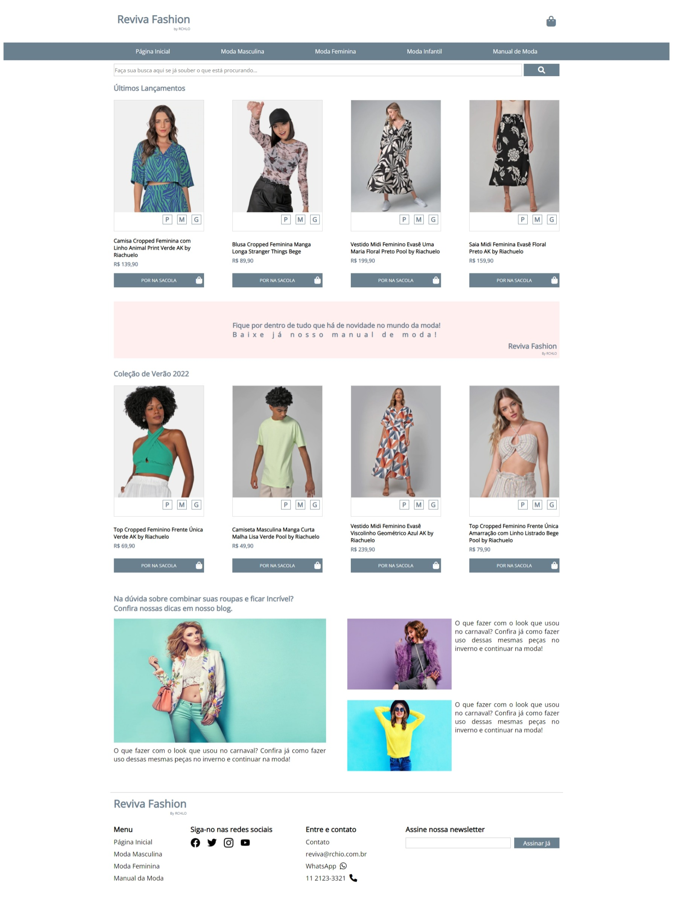

<h1 align="center">Projeto Reviva Fashion - React - NextJs</h1>

<p align="center">
  <a href="#dart-about">About</a> &#xa0; | &#xa0;
  <a href="#sparkles-features">Features</a> &#xa0; | &#xa0;
  <a href="#rocket-technologies">Technologies</a> &#xa0; | &#xa0;
  <a href="#white_check_mark-requirements">Requirements</a> &#xa0; | &#xa0;
  <a href="#checkered_flag-starting">Starting</a> &#xa0; | &#xa0;
  <a href="#memo-license">License</a> &#xa0; | &#xa0;
  <a href="https://github.com/lucasilvadrm" target="_blank">Author</a>
</p>

<br>

## :dart: About

Project developed during the UpTech by RCHLO program.

## Screenshots



## :rocket: Technologies

The following tools were used in this project:

- [HTML](https://devdocs.io/html/)
- [CSS](https://developer.mozilla.org/pt-BR/docs/Web/CSS)
- [SASS](https://sass-lang.com/)
- [Javascript](https://developer.mozilla.org/pt-BR/docs/Web/JavaScript)
- [Typescript](https://www.typescriptlang.org/)
- [React](https://pt-br.reactjs.org/)
- [NextJs](https://nextjs.org/)
- [JSON Server](https://www.npmjs.com/package/json-server)

## :white_check_mark: Requirements

Before starting :checkered_flag:, you need to have 
[Git](https://git-scm.com) and
[Node.js](https://nodejs.org/en/).

## :checkered_flag: Starting

bash
# Clone this project
```sh
$ git clone https://github.com/lucasilvadrm/uptech-reviva-react-next
```

# Access
```sh
$ cd uptech-reviva-react-next
$ npm install
$ npm run build
```

# Open in your favorite browser

Made with :heart: by <a href="https://github.com/lucasilvadrm" target="_blank">Lucas Silva</a>

&#xa0;

<a href="#top">Back to top</a>